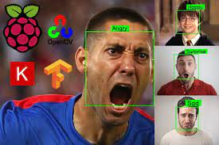
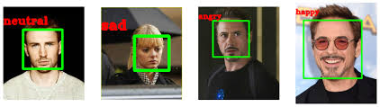

# Facial Emotion Detection
Convolutional Neural Networks for Facial Expression Recognition on the FER2013 Dataset.

We aim to appropriately categorise facial expressions into one of the seven categories listed below in this study.

*Angry----Disgust----Fear----Happy----Sad----Surprise----Neutral*

## Dataset

This URL will take you to the project's dataset: https://www.kaggle.com/deadskull7/fer2013  
Download the file, then unzip it.  
There are around 32300 photos listed in this single csv file.  

## Model

The model's greatest accuracy was about 63%.  
`Emotion_Recognition_Train.ipynb` contains the model and the pre-processing procedures.

By pressing this, the webcam will start and the frames collected by our trained model for inference will be fed.  
The faces in the frames are identified using a Haarcascade algorithm, and the detected region is then cropped to the required size and provided as input to the detector.

## Usage

`Detector_In_Action.py` in Python

By pressing this, the webcam will start and the frames collected by our trained model for inference will be fed.  
The faces in the frames are identified using a Haarcascade algorithm, and the detected region is then cropped to the required size and provided as input to the detector.

## Sample Output

